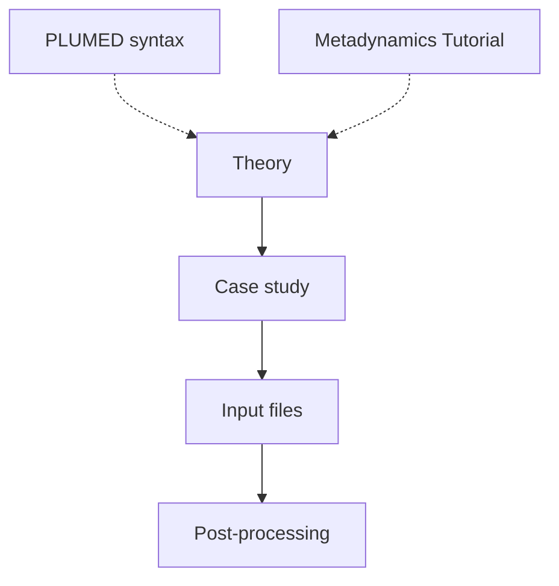

# AlphaFold-Metainference tutorial
A tutorial to setup and run AlphaFold-Metainference simulations. The original work which explains the theory for AlphaFold-Metainference (AF-MI) can be found [here](https://www.biorxiv.org/content/10.1101/2023.01.19.524720v1.full).

The tutorial comprises the following sections:

#### [AlphaFold-Metainference theory](theory.md)
A brief introduction to the theory and advantage in using AlphaFold-Metainference.

#### [Case study: TDP-43 WtoA monomer dynamics](case_study.md)
We will present the case study for this tutorial, the DNA/RNA processing protein TDP-43 which undergoes both functional and pathogennic aggregation in amyotrophic lateral sclerosis (ALS) and other neurodegenerative conditions. To enable a rapid structural ensemble generation on a laptop/workstation, AF-MI is coupled to the CALVADOS-2 coarse-grained forcefield.

#### [Input files preparation](input.md)
We will discuss all the preliminary steps to set up AF-MI, from generating the AF2 distance-map restraints data, to preparing PLUMED inputes, and running energy minimization and production runs

#### [Structural ensemble generation and post-processing analysis](postprocessig.md)
Finally, we will discuss how to generate the unbiased structural ensemble of TDP-43, estimate free energy surfaces along collective variables (CVs) and predict ensemble averaged properties such as secondary structureand RMSF.

___NB:___ This tutorial assumes that you know metadynamics theory and practice in PLUMED (if not, please visit [PLUMED tutorial](https://www.plumed-tutorials.org/lessons/21/004/data/NAVIGATION.html)).

